<!DOCTYPE html>
<html lang="en">
<head>
   <title>Media Queries</title>
   
</head>
<body>
   

      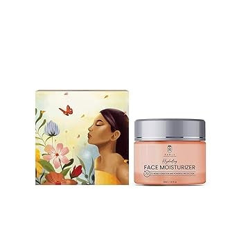
      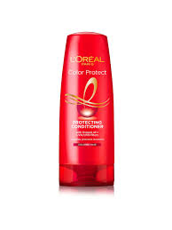
      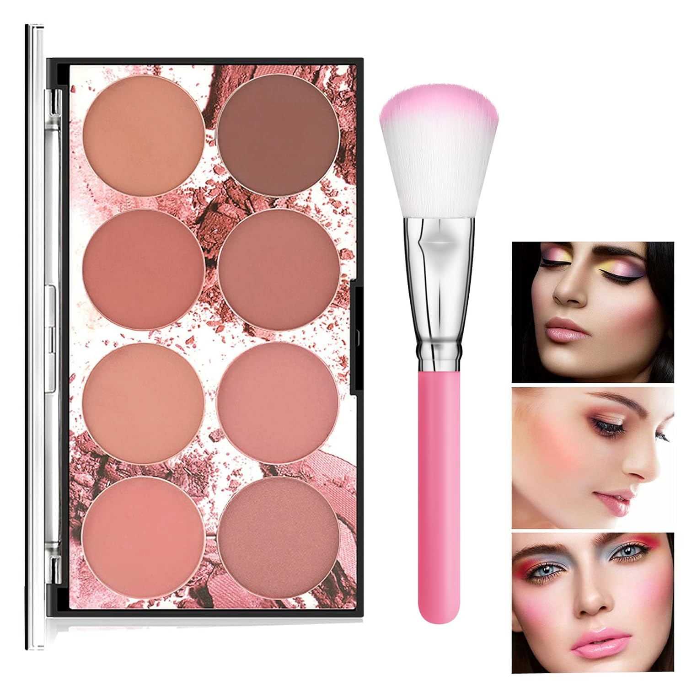
      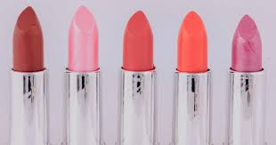
      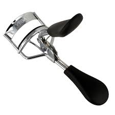
   
   

    <h1 class="text1"> &nbsp;&nbsp;&nbsp;BEAUTY PARLOUR PRODUCT &nbsp;&nbsp;&nbsp;</h1>
   <h2 class="text2">Moisturizer</h2>
    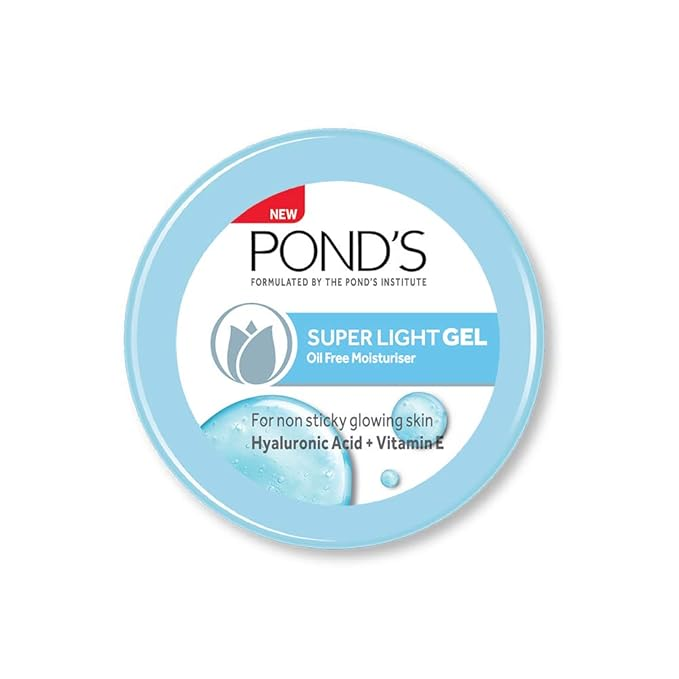
    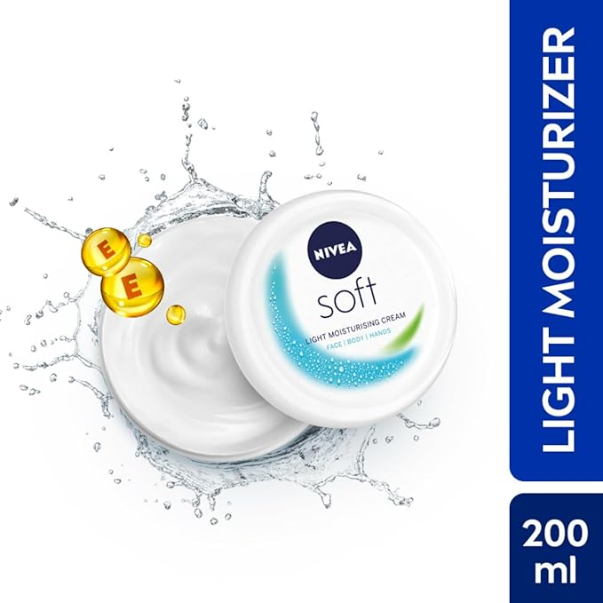
    
    
    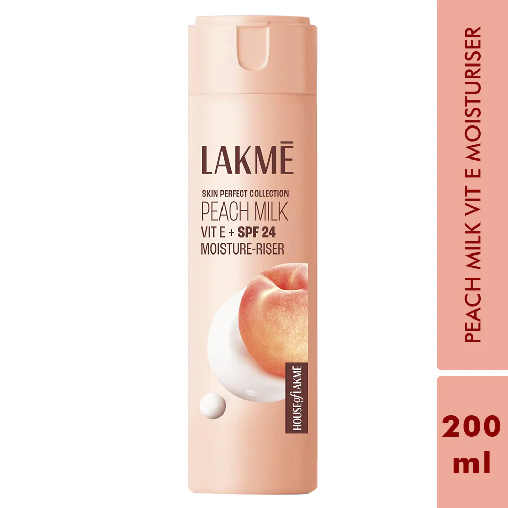
    
   

    <h2 class="text2">Conditioner</h2>
    
    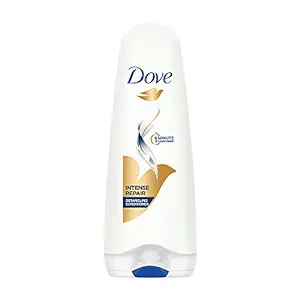
    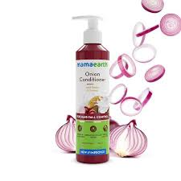
    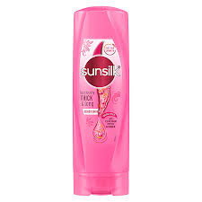
    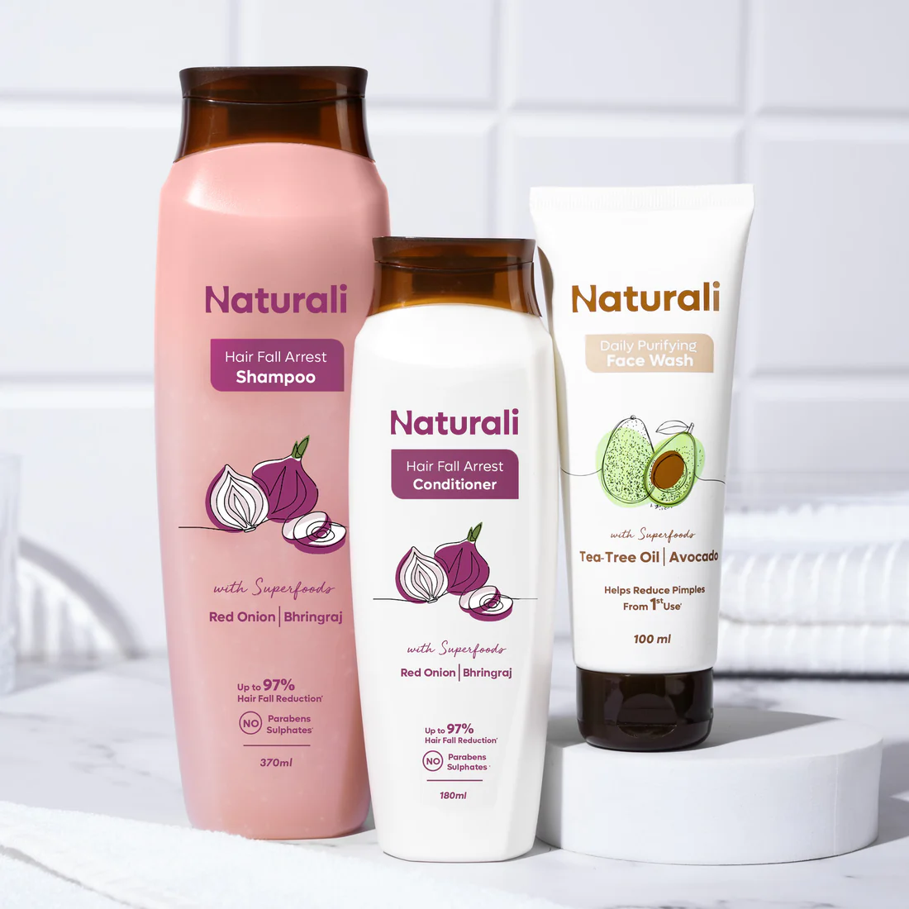
    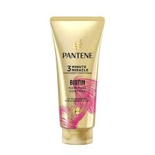
   

    <h2 class="text2">Blush</h2>
    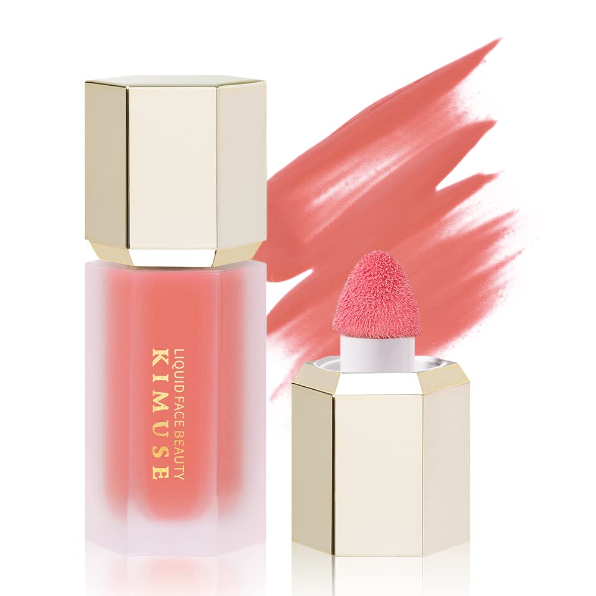
    
    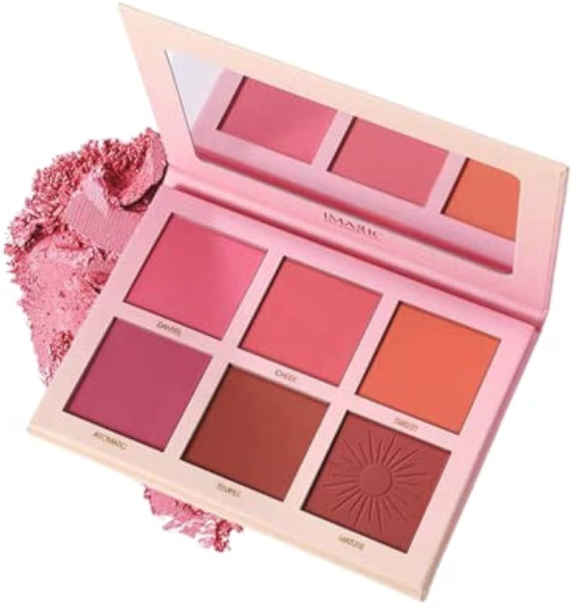
    
    
    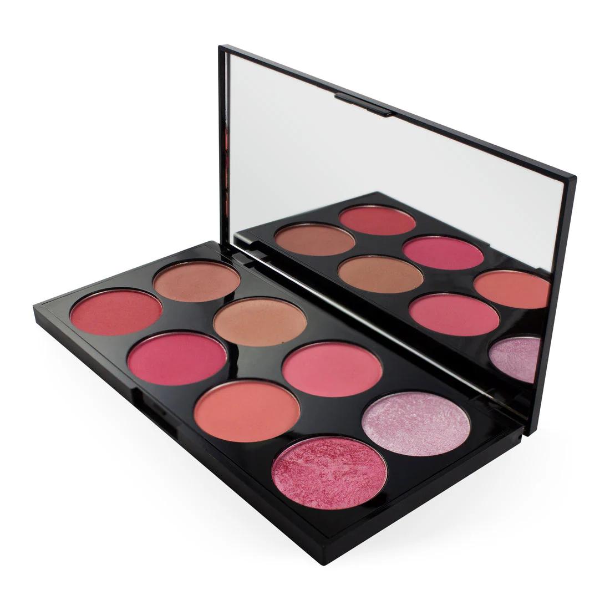
    

    <h2 class="text2">lipstik</h2>
    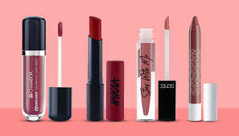
    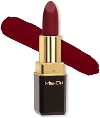
    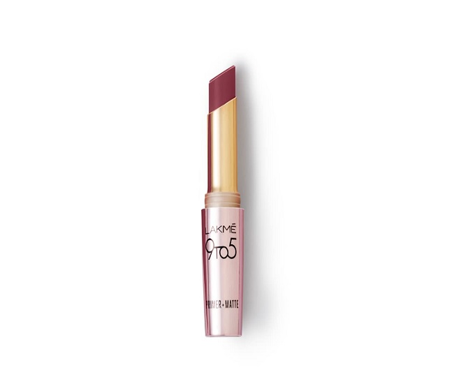
    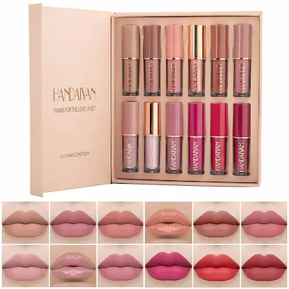
    
    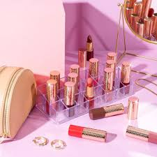

    <h2 class="text2">Eyelash curler</h2>
    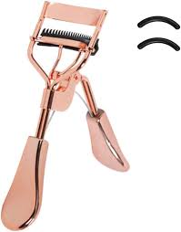
    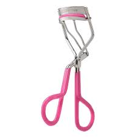
    
    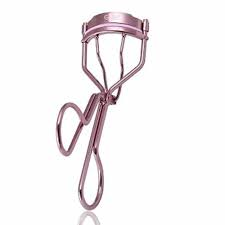
    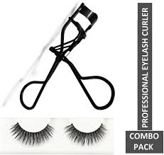
    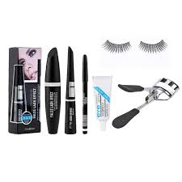
   </body>
</html>
